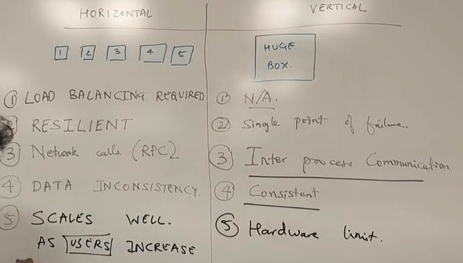
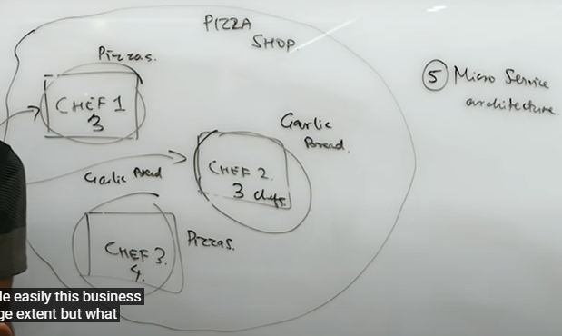
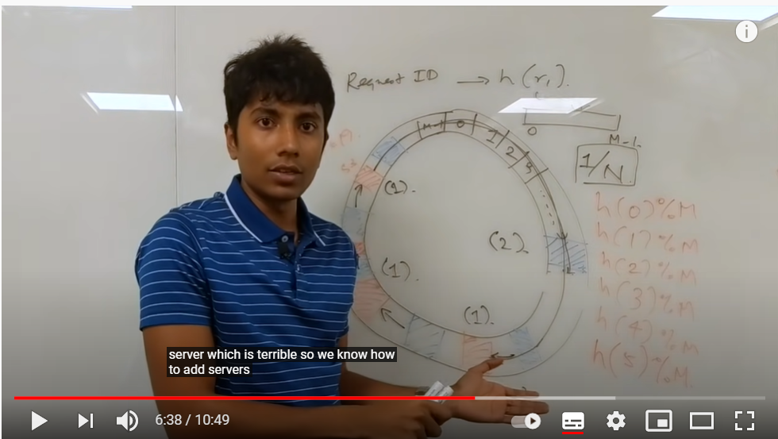
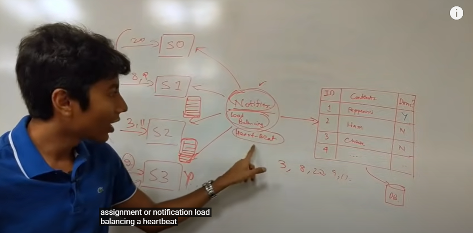
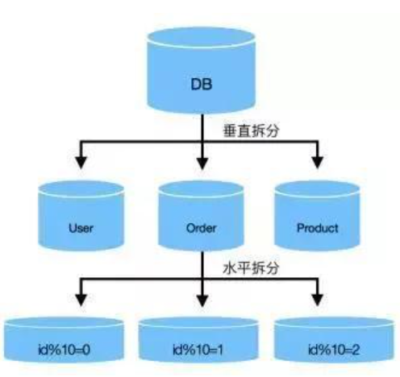
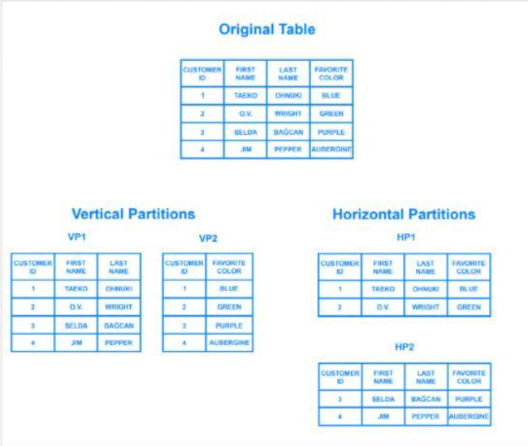
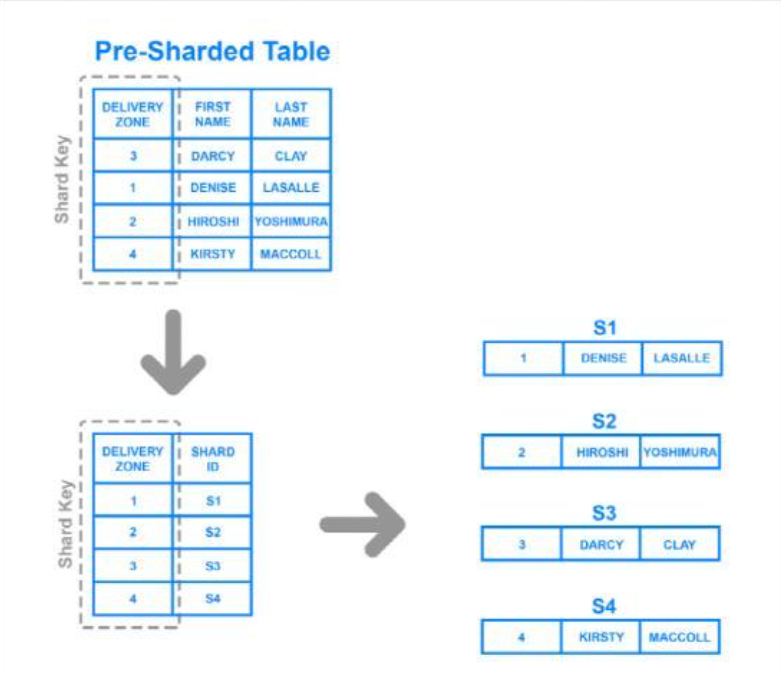
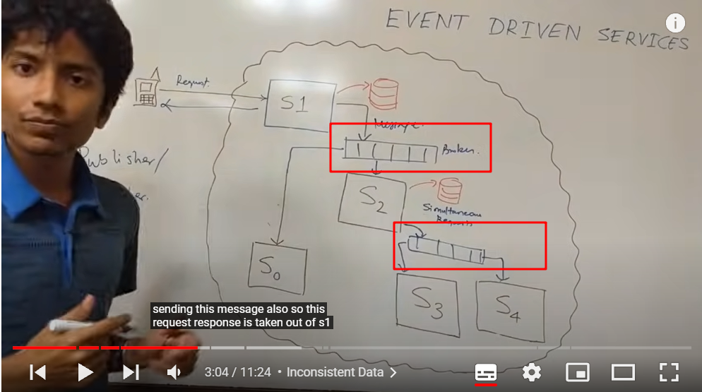

# System Design

[Course resources](https://www.youtube.com/playlist?list=PLMCXHnjXnTnvo6alSjVkgxV-VH6EPyvoX)

Course author: Gaurav Sen

Note By: xuhaobit@gmail.com

#### Course 1: System Design Basics: Horizontal vs. Vertical Scaling

- Scalability: 
  - 可扩展性，指的是Server进一步扩展的能力。通俗来讲，为了让Server获得更好的性能，往往有两种扩展的方式：i）买更多的机器，让这些机器作为Server，这样当多个请求过来时，server处理的效率更高了；ii）买一个更大的机器，这样server的处理能力、处理速度就更高了。
  - 通常将machine的数量变多叫做水平扩展性；将machine变大叫做垂直扩展性。

- Horizontal vs. Vertical Scaling

|          | HORIZONTAL                                        | VERTICAL                         |
| -------- | ------------------------------------------------- | -------------------------------- |
| 负载要求 | Load Balancing Required                           | N/A                              |
| 出现错误 | Resilient(韧性的，一个machine出错，系统不会结束)  | Single point a failure           |
| 进程通信 | Network calls (RPC, Remote Process Communication) | IPC, Inter process Communication |
| 一致性   | DATA INCONSISTENCY                                | Consistent                       |
| 可扩展性 | SCALES WELL AS USERS INCREASE                     | Hardware limit                   |

#### Course 2. System Design Primer: How to start with distributed systems?

- think about to have a pizza shop
  - how to scaling?
    - 1【Vertical Scaling，可伸缩性】Optimize process  and increase throughput with the same resource.
    - 2 Preparing before hand at non-peak hours.
    - 3【Backups】keep a backup and avoid single point of failure.
    - 4【Horizontal Scaling】Hire more resources.
    - 5 Micro Service architecture
    - 
    - 6 Distributed System (Build a new system)
    - 7 Load Balance (Build a manager to send request to Server in a balanced way.)
    - 8 Decoupling 【解耦】
    - 9 Logging and Metrics calculation.
    - 10 Extensible 【可扩展性】指的是增加组件、扩充功能的能力

#### Course3.4. Consistent Hashing

Consistent Hashing helps to make Load Balancing

- 为什么要使用一致性哈希？
  - 在对request进行hash的时候，如果同一个用户得到的结果是一致的，那么他的请求就会发到同一个server，因而可以将用户信息存放在server的cache中；
  - 而如果访问到的不同的server，那么用户信息将不停的从cache换下去，访问信息的复杂度就提升了。
- 顺时针hash结构
  - 
  - 优点：如果server够多的话，每一个request分配到server的概率都是平均的1/N；
  - 缺点：如果server少的话，会出现负载不均衡的情况（增加、减少server，负载会不均衡）
- 改进结构
  - 每一个server使用多个hash function，这样的话，尽管server少，映射之后还是会变多；在server减少一个之后，在圈形结构中也是均匀的减少，这样尽可能最大的保持部分资源不变。
  - 
  - 经典饼图（最小改变）
- 使用场景？
  - 分布式系统的负载均衡问题
  - web缓存（同一用户经过一致哈希之后，映射到同一个服务器，这样可以保证缓存的高效命中）
  - 数据库

#### Course 5. Message queue

- Notifier with: Load Balancing, Heart-Beat and DB Persistence --> **Message/Task Queue**
- 
  - 理解：server要处理的request被放入task queue里面，然后所有的task被均匀的分配给了所有的server，当某些server宕机之后，notifier通过心跳包检测到server的id，并在持久化的db中查到sid对应的未完成的task（request），然后负载均衡地将未完成的request再分配给其他的server。最终实现异步RPC。
- 举例：JMS(Java Message Service), ActiveMQ, RabbitMQ
- 使用场景：业务解耦/最终一致性/广播/错峰流控；如果需要强一致性，关注业务逻辑的处理结果，那么只需要RPC就好了。

#### Course 6. What is a micro-service architecture and it's advantages?

- monolithic vs. microservice

  - 单体应用程序：服务由多个模块所组成，将所有的模块打包成为一个包，作为一个进程运行。用户界面、数据访问层、数据部署层是紧密耦合的。【例：系统的各个模块可能访问同一个db，因此他们是协作的】

    - 【Advantages】Good for small team: 如果团队比较小，个人员都清楚系统的业务流程，那么没必要做成微服务，个人仅负责各个模块的开发即可。
    - Less Complex：考虑的东西少，比如不需要考虑怎么将系统划分为好几个部分，并且不需要考虑各个部分之间怎么通信，保证一致性等等。【个人理解】
    - Less Duplication：对于配置文件等等其他类型的文件，不需要复制到各个服务中，仅仅存在一份即可。
    - Faster，Procedure Calls：模块之间协作仅仅作为进程内的协作，不需要RPC等方式就可以通信。
    - 【Disadvantages】More context required：当新的组员加入时，他需要了解的东西太多了，需要将整个系统了解才可以知道他所需要做哪些工作（不然他不会理解）
    - Complicated Deployments：部署会比较复杂，当你检查到一个模块出现问题时，需要你重新打包整个项目并且再次部署。
    - Single Point of Failure！：单点出现问题之后，整个服务都需要重启。

  - 微服务：一组松散耦合的组件，可以一起工作并执行任务。【各个模块有自己的db】

    - 【Advantages】Scalability
    - Easier for new team members
    - Working in Parallel
    - Easier to reason about：比如一个聊天系统，可以很方便的知道哪个微服务是重要的，因此为那个服务扩展更多的机器以提高性能
    - 【Disadvantages】Hard to Design，Needs skilled Architects：比如你发现S1总是和S2进行交互，那么把他们合并成一个Service就可以

    

#### Course 7. What is Database Sharding?【分片】

- Horizontal Partitioning vs. Vertical Partitioning
  - 
  - 垂直拆分
    - 按照业务等等对数据库中的表（不一定是不同的表，同一表的不同列也可以）进行分组，相同类型放在新的同一个数据库中。
  - 水平拆分
    - 如果一个表过大，按照某种规则（比如某个值>threshold；hash值等）划分为多个组，将这些组存放在不同的数据库中。
  - 
  - 分库分表（也就是表层级的拆分和数据库层级的拆分）
  - 一般业务比较小采用分表即可，级别大可以采用分库；同时也要注意分库带来的问题，比如常见的分布式问题，分布式事务、高可用、数据一致等
- 水平拆分数据库实例--数据库分片
  - 【优势】
    - 帮助系统的水平扩展（horizontal scaling）：在水平扩展之后，将部分数据迁移到新的节点上
    - 加速查询响应时间
    - 降低宕机的影响：分片之后，宕机仅仅影响到对应片的数据库的系统
  - 【劣势】
    - 分片的数据库架构十分复杂：体现在两方面，i）分片过程可能导致数据丢失或者表损坏，风险很大；ii）正确使用分片也可能对团队工作流程产生重大的影响（虽说水平划分是按照某种规则来的，但是当某种业务不按照该规则进行访问数据时，分片的劣势就体现了）。
    - 分片容易导致不平衡，数据可能会往一个片的数据库倾斜，最终回答到负载最大，面临着再次分片的问题
    - 对数据库分片之后，很难将其恢复到未分片的架构
    - 并不是所有的数据库引擎都支持分片
  - **基于键的分片** Key Based Sharding
    - 【描述】将一个静态列（数据不随时间改变而改变）进行哈希之后，按照值写入不同的数据库中。
    - 【劣势】动态添加/删除服务器的时候事情会变的棘手，产生数据的重新映射以及迁移，可以采用一致hash的方法，尽量减少数据迁移量
    - 【优势】均匀分布数据
  - **基于范围的分片** Range Based Sharding
    - 【desc】比如按照某个商品的价格进行分片
    - 【ad】实现简单，写入读取也简单
    - 【disad】不能预防数据不均匀分布，比如50-100块钱的商品很多，而100,000块钱以上的商品很少
  - **基于目录的分片** Directory Based Sharding
    - 【desc】原始数据的某一列作为分片键，数据在哪个分区通过维护一个查找表来实现。也就是说，在查找数据时，现根据分片键查找到数据所在分区，再在该分区进行查找
    - 
    - 【优势】灵活性，对比范围分片只能指定键的范围，键的分片只能指定一种哈希函数，他们更改起来比较麻烦。
    - 【劣势】每次查找需要进行一次查表，性能下降；有单点故障，查找表损坏，会导致系统无法正常运行
- 本章节图片参考：https://zhuanlan.zhihu.com/p/57185574

#### Course 8 How Netflix onboards new context: Video Processing at scale

- Problem Description
- Video formats and resolutions
  - codec to compress the video, 高质量、中等质量、低质量。。。
  -  different resolutions，1080p、720p等等 
- Chunk processing  
  - 将视频划分为块
  - Scenes>Timestamp，将视频按场景分块，而非按时间：将视频按照4s分为一个shot，将多个shot组合成一个scene
  - Sparse & Dense Movie，对应着不同的请求策略，每次请求得到的视频数量的多少
- Storage
  - Amazon S3，只保存常量数据，不提供修改
- Open Connect for video caching
  - 建立了Open Connect Box来缓存某些视频，避免访问美国的服务器
- Summary

#### Course 10. What is Distributed Caching?  Explained with Redis!

> 分布式系统中的缓存是设计可扩展系统的一个重要方面。 我们首先讨论什么是缓存以及我们为什么使用它。 然后我们讨论分布式系统中缓存的关键特性是什么。
>
> 这里提到了LRU和Sliding Window的缓存管理策略。 为了获得高性能，必须谨慎选择缓存驱逐策略。 为了保持数据一致和内存占用低，我们必须选择write through或write back一致性策略。
>
> 缓存管理很重要，因为它与缓存命中率和性能有关。 我们讨论分布式环境中的各种场景。

- Why use Caches?
  - Save Network Calls: 重复的请求结果保存在缓存中
  - Avoid Computations: 将计算结果保存在缓存中
  - Reduce DB Load: 将部分DB信息保存在缓存中，降低数据库的负载
  - 【前两种情况都是为了加快服务器对客户端的响应】
- Cache Policy
  - LRU (Least Recently Used)
  - 滑动窗口
- 缓存策略失败的坏处（选了一个不好的缓存策略
  - Extra Call
  - Thrashing（不停地换下去从未用到的数据）
  - Consistency

- In-memory Cache & Global Cache
  - in-mem cache：更快；更简洁
  - 全局cache：更准确；具有独立扩展性的特征
- Write-Through and Write-Back Cache
  - write through：当write时，先更新缓存内容，接着更新db
    - 当多个服务器的缓存中都有写入的内容X，这个策略仅仅能够更新一个缓存
  - write back：当write时，先写入db，接着将db的更新内容写入cache
  - 需要根据数据的重要性，选择何种缓存一致策略。
    - 对于非重要的数据，就采用直写策略，先写缓存，在一段时间之后再写入db；虽然对于其他服务器可能出现错误数据，但是当其他服务器cache未命中之后，便会再次更新（也就是说这种非重要数据，不在乎是不是对的）

#### Course 15. What is the Publisher Subscriber Model?

> 微服务受益于松散数据耦合，这是由发布订阅模型提供的。在此模型中，事件由发布服务生成并由下游服务消费。
>
> 设计微服务交互涉及事件处理和一致性检查。我们研究了发布-订阅架构，以评估它与请求响应架构相比的优缺点。
>
> 这种类型的架构依赖于消息队列来确保事件传递。一个例子是rabbitMQ 或Kafka。该架构在现实生活场景和采访中很常见。
>
> 如果事务没有强一致性保证，事件模型在微服务中使用是很好的。以下是主要优点：
>
> 1) 解耦系统的服务。
> 2) 无需通知对方即可轻松添加订阅者和发布者。
> 3) 将多点故障转化为单点故障。
> 4) 交互逻辑可以移动到服务/消息代理。
>
> 缺点：
> 1) 额外的交互层会减慢服务的速度
> 2) 不能用于要求数据强一致性的系统
> 3) 团队重新设计、学习和维护消息队列的额外成本。
>
> 该模型为事件驱动系统提供了基础。

- 传统微服务架构
  - failure latency：当某个服务在等待其他微服务时，若被等待的服务failure，那么等待服务需要很长一段时间才知道
  - data inconsistent
- 发布-订阅模型
  - 将消息发送到broker中，像RabbitMQ、Kafka
  - 
- 模型优势：
  - Decoupling
  - Simplifies Interactions：
    - S1只需要发送一种到broker的请求，而非需要单独的发送给S0或者S2，交互更加方便；
    - 多点failure转化为单点failure
  - Some Transaction Capability：一旦S1的请求发送给broker，他就会持久化，因此会确保S0、S2会收到请求。
  - Easily Scalable：新添加的服务，只需要在message broker那里登记即可
- 劣势：
  - poor consistency(major drawback)
  - 【幂等性】用户对于同一操作发起的一次或多次请求的结果是一致的。比如用户发起支付请求，若因为网络原因失败，那么下一次请求不应该多次扣钱
  - Idempotency still required
  - RPC会使效率降低

#### Course 16: Why do Database fail? AntiPatterns to avoid!

> 数据库通常用于存储各种类型的信息，但它成为问题的一种情况是用作消息代理时。
>
> 数据库很少设计用于处理消息传递功能，因此不能很好地替代专门的消息队列。在设计系统时，这种模式被认为是一种反模式。
>
> 以下是可能的缺点：
> 1) 必须正确设置轮询间隔。太长会使系统效率低下。太短会使数据库承受沉重的读取负载。
> 2) 读写操作繁重的DB。通常，他们擅长两者之一。
> 3) 要编写手动删除程序以删除已读消息。
> 4) 在概念上和物理上扩展都很困难。
>
> 消息队列的缺点：
> 1) 向系统添加更多活动部件。
> 2）设置MQ和培训的成本很大。
> 3）对于小型服务来说可能有点矫枉过正。
>
> 在系统设计面试中，能够推理为什么或为什么不需要系统需要消息队列很重要。这些原因使我们能够争论这两种方法的优缺点。
>
> 但是，有一些博客介绍了为什么数据库也可以完美地用作消息队列。对利弊的深入了解有助于评估它们对于给定场景的有效性。
>
> 一般来说，对于小型应用程序，数据库很好，因为它们不会为系统带来额外的移动部件。对于复杂的消息发送需求，有一个抽象如消息队列为我们处理消息传递是很有用的。

【background】使用db作为mq被认为是一种反模式，因而需要避免！

- Database as Message Queues
  - 数据库只能接收client的信息，但是不能发送给client信息；因此client（订阅者）需要采用轮询的方式来判断是否有自己的消息；问题出在频繁轮询->就需要考虑DB的负载/长间隔（inefficient）回复，总之需要均衡轮询间隔。
  - 对于MQ来说，往往面临繁重的read（R）或者write（create, write, delete）任务；但是db总是不能两者都擅长；并且多server访问db还面临着锁、死锁等系统层级的问题
  - 扩展能力糟糕；对于已经满负荷的系统，在水平扩展时，加入额外的server意味着需要另外一个db来实现mq，但是db之间交流变得很难。
- message queue的优势在于弥补上述几点；比如mq会发送消息给server，因而它没有server轮询时间的问题；mq只需要关注写性能而忽略读性能；mq可以通过扩展memory来水平扩展
- mq的劣势：
  - 小型服务没有必要使用mq，db可以很好的完成工作
  - 要关注系统的结构，如果系统write操作很少，反而read很多，那么需要考虑db，并优化db的读性能
  - mq的培训成本高

